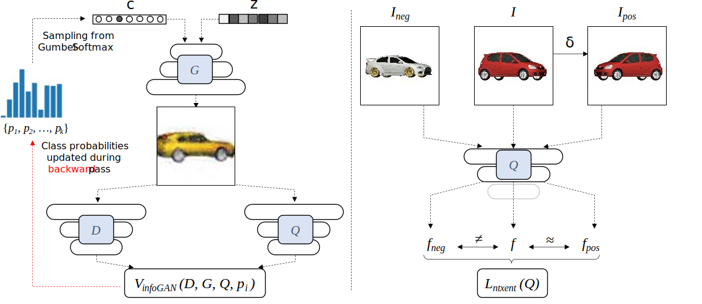
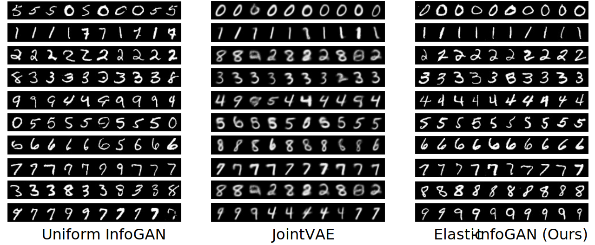
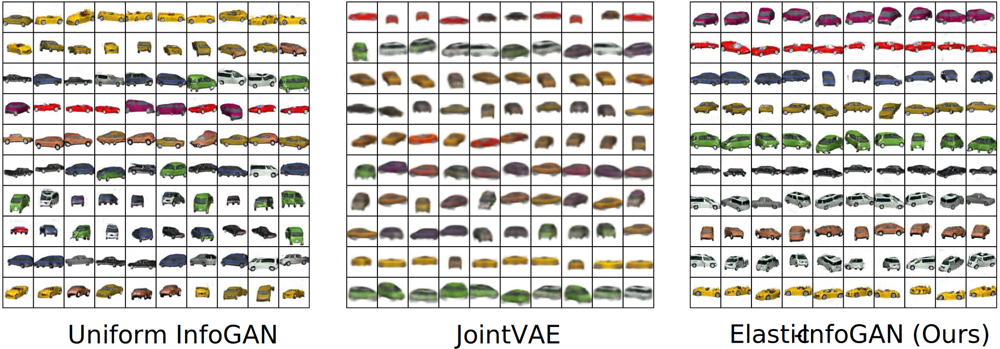
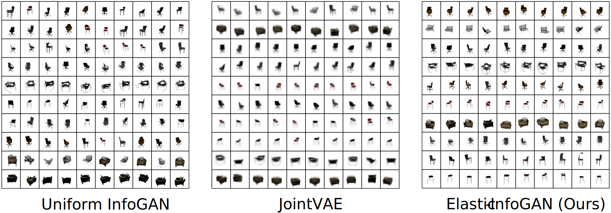
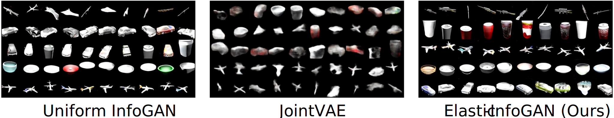
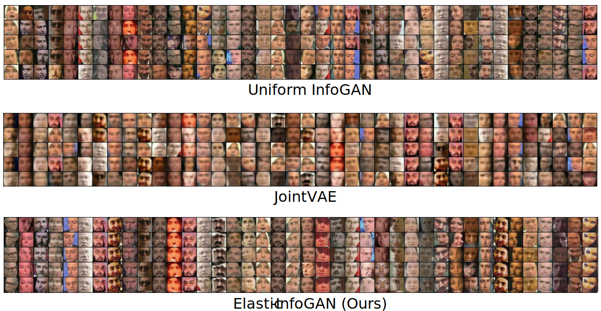

# Elastic-InfoGAN 
### [website](https://utkarshojha.github.io/elastic-infogan/) | [paper](https://arxiv.org/abs/1910.01112)

This repository provides the official PyTorch implementation of Elastic-InfoGAN, which allows disentangling the discrete factors of variation in class-imbalanced data without access to the ground-truth distribution.

[Elastic-InfoGAN: Unsupervised Disentangled Representation Learning in Class-Imbalanced Data](https://utkarshojha.github.io/elastic-infogan/)
[Utkarsh Ojha](https://utkarshojha.github.io/), [Krishna Kumar Singh](http://krsingh.cs.ucdavis.edu/), [Cho-jui Hsieh](http://web.cs.ucla.edu/~chohsieh/), [Yong Jae Lee](https://web.cs.ucdavis.edu/~yjlee/) <br>
UC Davis, UCLA, and Adobe Research <br>
In NeurIPS 2020



## System requirements
- Linux
- Python 2
- NVIDIA GPU + CUDA CuDNN
- Python2.7
- PyTorch 1.3.1
- Imageio
- Torchvision 0.4.2
- Augmentor

## Creating the dataset
- ```./splits/70k.pt``` contains the original MNIST dataset.
- ```./splits/50_data_imbalance.npy``` contains 50 (random) class-imbalance information.
- Run ```bash data.sh``` to create the 50 imbalanced MNIST datasets, which will be stored in the ```splits``` directory.

## Elastic-InfoGAN training 
- Train the model on all the 50 random splits:
``` bash run.sh ```
- Intermediate generated images (different rows correspond to different discrete latent codes) will be stored in the ```results``` directory.
- Trained models will be stored in the ```saved_models``` directory.

## Elastic-InfoGAN evaluation
- The 50 pre-trained generator models, each trained on 50 imbalanced splits respectively, are available at this [link](https://drive.google.com/file/d/1Xv6GNSn3zlbxotto7wXlLo9p7eDnPRz8/view?usp=sharing).
- Unzip and extract all the models in the ```mnist_pretrained```, and run 
``` bash eval.sh```
- This will compute the Normalized Mutual Information (NMI) and Average Entropy (ENT).

## Example results
### Imbalanced MNIST


### Imbalanced 3D Cars


### Imbalanced 3D Chairs


### Imbalanced ShapeNet


### Imbalanced YouTube-Faces


## Citation

If you find our work/code useful in your research, please cite our paper.
```
@inproceedings{elastic-infogan2020,
  title={Elastic-InfoGAN: Unsupervised Disentangled Representation Learning in Class-Imbalanced Data},
  author={Ojha, Utkarsh and Singh, Krishna Kumar and Hsieh, Cho-Jui and Lee, Yong Jae},
  booktitle={Advances in Neural Information Processing Systems (NeurIPS)},
  year={2020}
}
```
- The Gumbel-softmax implementation was taken from this wonderful [work](https://github.com/ericjang/gumbel-softmax) by Eric Jang et al. 	 
- The implementation for Normalized Temperature-Scaled Cross Entropy loss was taken from this [repository](https://github.com/sthalles/SimCLR) by Thalles Silva.
  
For any queries related to this work, please contact [Utkarsh Ojha](https://utkarshojha.github.io/)
 
